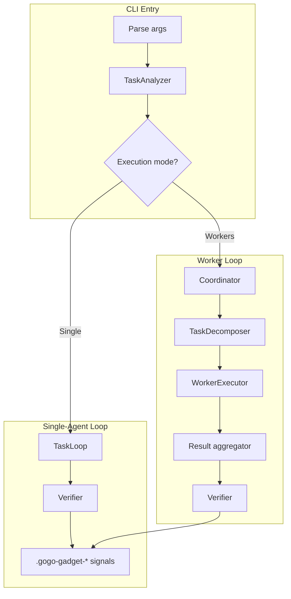
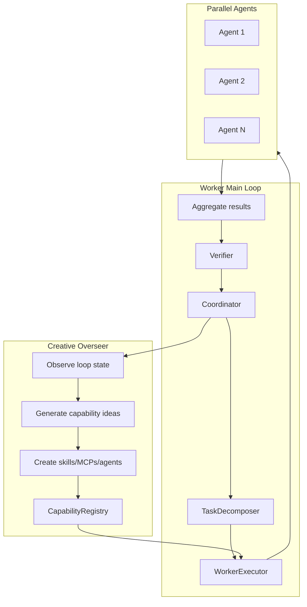
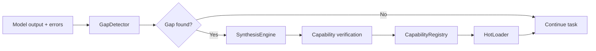

# GoGoGadget

Autonomous AI agent framework that detects capability gaps and synthesizes new tools (skills, MCPs, agents) to close them.

## Quick start

```bash
# Clone the repository
git clone git@github.com:YOUR_USERNAME/gogo-gadget.git
cd gogo-gadget

# Build
cargo build --release

# Basic task execution
./target/release/gogo-gadget "Refactor the authentication module"

# Self-extending mode (default on, shown explicitly here)
./target/release/gogo-gadget --self-extend "Fetch GitHub repo stats and summarize"

# Worker mode with 5 agents (CLI: --swarm)
./target/release/gogo-gadget --swarm 5 "Implement a CRUD API"

# Dry-run to see the plan without executing
./target/release/gogo-gadget --dry-run "Your task here"
```

## Core workflows

- **Single-agent loop**: Iterative execution + verification until completion.
- **Worker loop**: Task decomposition + parallel agents + aggregation + verification.
- **Self-extend**: Detect capability gaps and synthesize tools on the fly.
- **RLM**: Recursive Language Model mode for large codebases and cross-file analysis.

## Design choices and rationale

These are the core system-level decisions reflected in the code. Each item lists why it exists and where it lives.

- **Ralph-style iteration loop**: run until verified completion (not arbitrary iteration limits) to reduce partial or shallow work (`src/task_loop.rs`).
- **Signal files for completion**: simple, tool-agnostic completion signaling and external orchestration (`src/task_loop.rs`, `src/swarm/coordinator.rs`).
- **LLM-driven task analysis**: nuanced complexity/difficulty detection vs regex heuristics (`src/brain/mod.rs`).
- **Worker mode for parallel-safe work**: speedups when subtasks can be isolated (`src/swarm/*`).
- **Goal-anchor drift checks**: prevent agents from wandering off-task during long runs (`src/swarm/coordinator.rs`).
- **Creative Overseer**: proactive capability brainstorming so tools appear before they are blocking (`src/extend/overseer.rs`).
- **Gap detection via output + failure history**: catches missing capabilities from explicit and implicit signals (`src/extend/gap.rs`).
- **Template-driven synthesis**: repeatable, predictable MCP/skill/agent scaffolding (`src/extend/synthesis.rs`).
- **Capability registry + usage tracking**: manage and prune synthesized tools over time (`src/extend/registry.rs`).
- **Hot loading**: new skills/MCPs are usable without waiting for future runs (`src/extend/loader.rs`).
- **Verification uses build/test + LLM check**: combines ground truth with contextual reasoning (`src/verify/mod.rs`).
- **Anti-laziness detection**: guards against placeholders, TODOs, and fake evidence (`src/verify/mock_detector.rs`).
- **Evidence levels**: configurable strictness to match task risk (`src/main.rs`, `src/task_loop.rs`).
- **Checkpointing + shutdown handling**: resumable long tasks and graceful exits (`src/task_loop.rs`, `src/main.rs`).
- **Subagent mode**: integrates with Claude Code toolchains (`src/subagent.rs`, `src/main.rs`).
- **RLM pipeline**: recursive chunking + navigation for large contexts (`src/rlm/*`).

## Architecture diagrams

### System overview (single vs workers)



### Worker main loop + Creative Overseer



### Self-extend pipeline (reactive)



- Flowcharts + explanations: `docs/architecture/flowchart.md`
- ASCII overview: `docs/architecture/diagram-ascii.txt`

## Documentation

- Core spec: `docs/specs/core.md`
- Self-extend spec: `docs/specs/self-extend.md`
- RLM deep-dive: `docs/agents/rlm-architecture.md`
- RLM tuning: `docs/agents/rlm-tuning.md`
- Known issue report: `docs/bugs/workers-verification.md`

## Repository layout

```
docs/            Architecture diagrams, specs, and agent notes
scripts/         CLI wrappers and completions
src/             Core engine and execution loop
tests/           Unit + integration tests
```

## Runtime directories

Runtime artifacts are intentionally not committed:

- `~/.gogo-gadget/` for synthesized capabilities and registry data
- `~/.claude/skills` for skills that should be available to Claude
