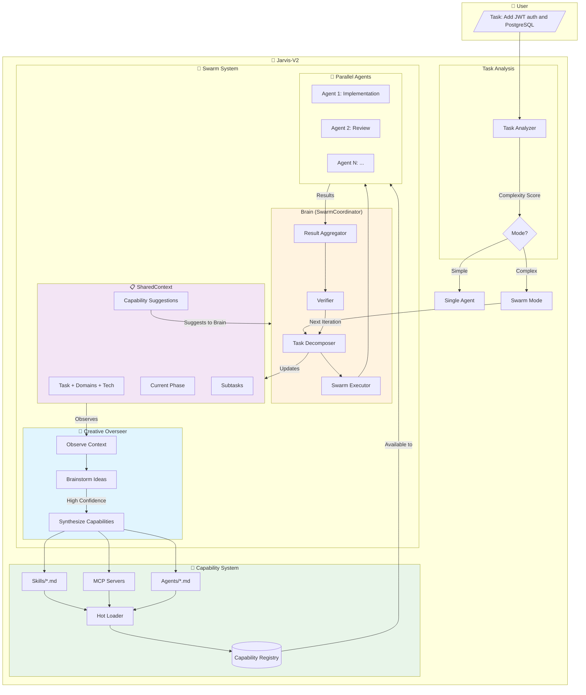
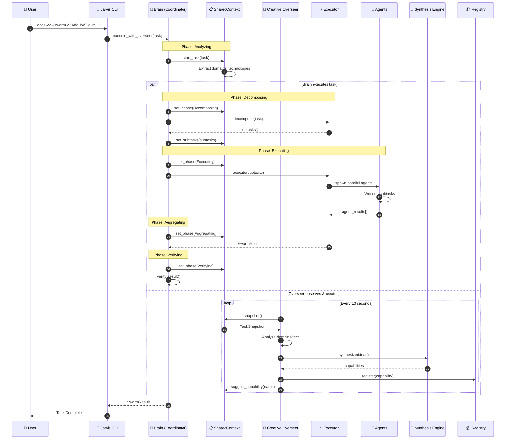
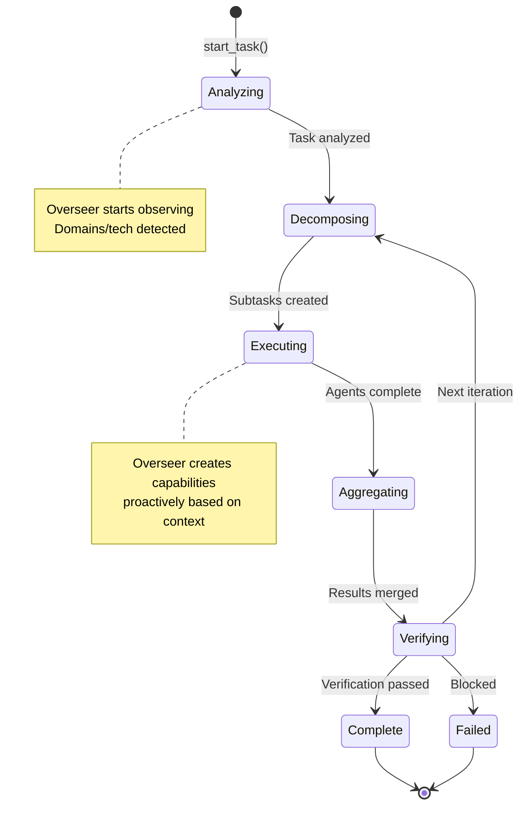
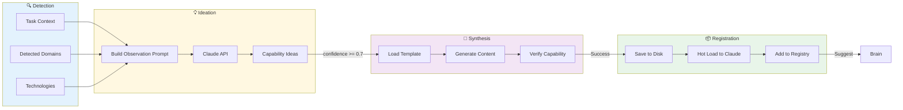
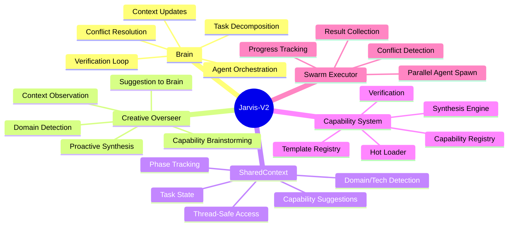

# Jarvis-V2 System Architecture

## High-Level Overview



## Detailed Execution Flow



## SharedContext State Machine



## Capability Synthesis Pipeline



## Component Responsibilities



## File Structure

```
src/
├── main.rs                 # CLI entry point
├── swarm/
│   ├── mod.rs              # Swarm types
│   ├── coordinator.rs      # Brain (orchestration)
│   ├── executor.rs         # Parallel agent execution
│   └── decomposer.rs       # Task decomposition
└── extend/
    ├── mod.rs              # Capability types
    ├── context.rs          # SharedContext
    ├── overseer.rs         # Creative Overseer
    ├── synthesis.rs        # Capability synthesis
    ├── loader.rs           # Hot loading
    ├── registry.rs         # Capability registry
    └── verify.rs           # Capability verification
```

## Key Data Flows

| Flow | From | To | Data |
|------|------|-----|------|
| Task Start | Brain | SharedContext | task, domains, technologies |
| Phase Update | Brain | SharedContext | TaskPhase enum |
| Observation | SharedContext | Overseer | TaskSnapshot |
| Synthesis | Overseer | Registry | SynthesizedCapability |
| Suggestion | Overseer | SharedContext | capability name |
| Discovery | Brain | SharedContext | suggested capabilities |

## Usage

```bash
# Run with Creative Overseer (default)
jarvis-v2 --swarm 3 "Add authentication to the API"

# Disable overseer for faster execution
jarvis-v2 --swarm 3 --no-overseer "Quick fix"

# Standalone capability synthesis
jarvis-v2 --overseer-only "Build a user management system"
```
