# Jarvis-V2 System Architecture

## High-Level Overview


## Detailed Execution Flow

```mermaid
sequenceDiagram
    autonumber
    participant U as 👤 User
    participant J as 🤖 Jarvis CLI
    participant B as 🧠 Brain (Coordinator)
    participant C as 📋 SharedContext
    participant O as 🎨 Creative Overseer
    participant E as ⚡ Executor
    participant A as 🤖 Agents
    participant S as 🔧 Synthesis Engine
    participant R as 📦 Registry

    U->>J: jarvis-v2 --swarm 2 "Add JWT auth..."
    J->>B: execute_with_overseer(task)

    Note over B,C: Phase: Analyzing
    B->>C: start_task(task)
    C->>C: Extract domains, technologies

    par Brain executes task
        Note over B,E: Phase: Decomposing
        B->>C: set_phase(Decomposing)
        B->>E: decompose(task)
        E-->>B: subtasks[]
        B->>C: set_subtasks(subtasks)

        Note over B,A: Phase: Executing
        B->>C: set_phase(Executing)
        B->>E: execute(subtasks)
        E->>A: spawn parallel agents
        A->>A: Work on subtasks
        A-->>E: agent_results[]

        Note over B: Phase: Aggregating
        B->>C: set_phase(Aggregating)
        E-->>B: SwarmResult

        Note over B: Phase: Verifying
        B->>C: set_phase(Verifying)
        B->>B: verify_result()

    and Overseer observes & creates
        loop Every 10 seconds
            O->>C: snapshot()
            C-->>O: TaskSnapshot
            O->>O: Analyze domains/tech
            O->>S: synthesize(ideas)
            S-->>O: capabilities
            O->>R: register(capability)
            O->>C: suggest_capability(name)
        end
    end

    B-->>J: SwarmResult
    J-->>U: Task Complete
```



## SharedContext State Machine


## Capability Synthesis Pipeline


## Component Responsibilities


## File Structure

```
src/
├── main.rs                 # CLI entry point
├── swarm/
│   ├── mod.rs              # Swarm types
│   ├── coordinator.rs      # Brain (orchestration)
│   ├── executor.rs         # Parallel agent execution
│   └── decomposer.rs       # Task decomposition
└── extend/
    ├── mod.rs              # Capability types
    ├── context.rs          # SharedContext
    ├── overseer.rs         # Creative Overseer
    ├── synthesis.rs        # Capability synthesis
    ├── loader.rs           # Hot loading
    ├── registry.rs         # Capability registry
    └── verify.rs           # Capability verification
```

## Key Data Flows

| Flow | From | To | Data |
|------|------|-----|------|
| Task Start | Brain | SharedContext | task, domains, technologies |
| Phase Update | Brain | SharedContext | TaskPhase enum |
| Observation | SharedContext | Overseer | TaskSnapshot |
| Synthesis | Overseer | Registry | SynthesizedCapability |
| Suggestion | Overseer | SharedContext | capability name |
| Discovery | Brain | SharedContext | suggested capabilities |

## Usage

```bash
# Run with Creative Overseer (default)
jarvis-v2 --swarm 3 "Add authentication to the API"

# Disable overseer for faster execution
jarvis-v2 --swarm 3 --no-overseer "Quick fix"

# Standalone capability synthesis
jarvis-v2 --overseer-only "Build a user management system"
```
