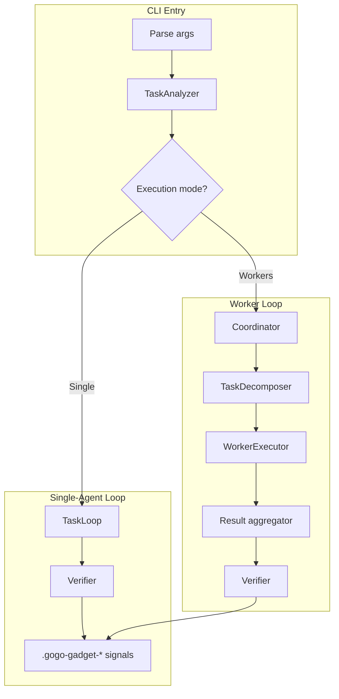
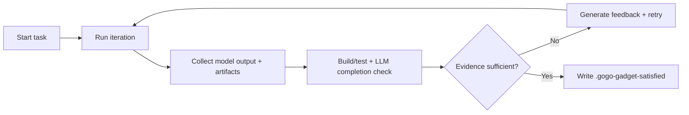
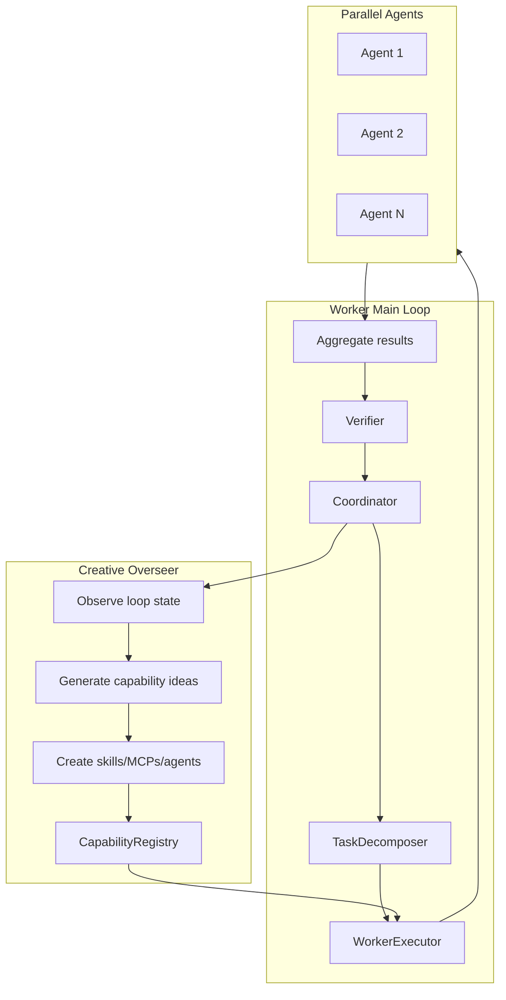
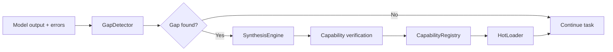
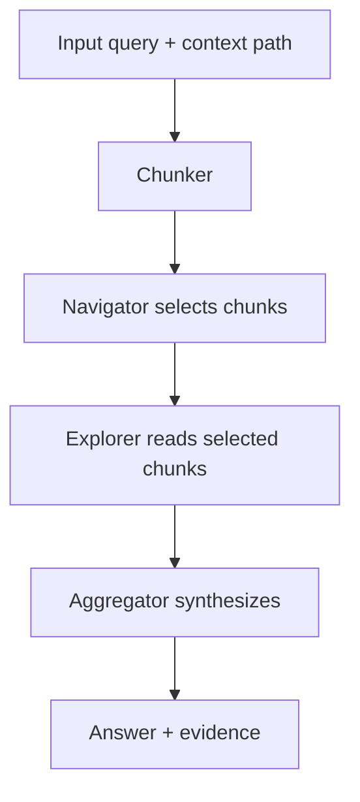

# GoGoGadget Architecture Flowcharts

These flowcharts are derived from the current code paths in `src/` and are meant to be read top-down.
Each chart includes a short explanation so the intent is clear without cross-referencing code.

## 1) System Overview (Single vs Workers)

Explains how the CLI selects an execution mode, runs the loop, and verifies completion.

## 2) Iterative Task Loop (Verification First)

Shows the Ralph-style loop that runs until evidence-backed completion is reached.
Anti-laziness checks are integrated into the verification step.

## 3) Worker Mode + Creative Overseer

Worker mode runs a central execution loop (the "brain") while the Creative Overseer
observes the loop state and injects new capabilities into the executor. The overseer
does not replace the loop; it continuously augments it.

## 4) Self-Extend Pipeline (Reactive)

Gap detection monitors output and failure history to create new tools when missing
capabilities block progress.

## 5) RLM (Recursive Language Model) Pipeline

RLM treats large contexts as explorable terrain by chunking, selecting, and
recursively drilling down before synthesizing a final answer.

